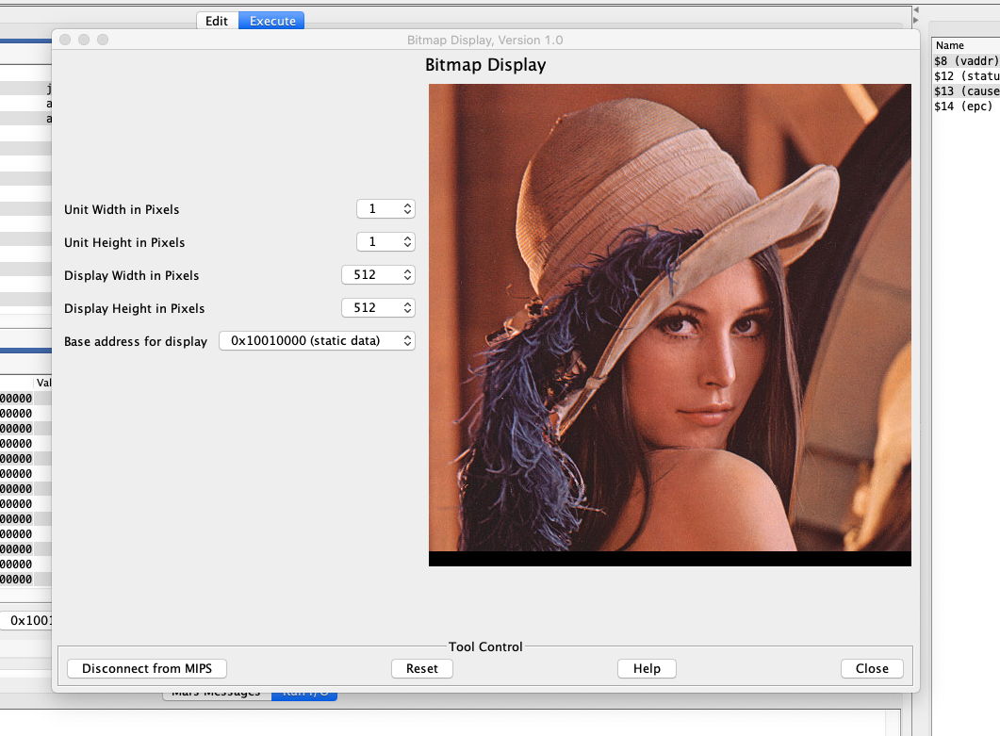

# mips_image_processing

<b>Language used to comment in the whole code is english</b>.

This program will read a bmp image and process according the user choice. MIPS assembly language and Mars 4.5 was used to achieve this task. To get the thing working, just put mars into the same folder as the main.asm file and img.bmp as well. It should work fine.

The implemented filters are:
<ul>
<li>Color Rotation</li>
<li>Rotation 90 degree left and right</li>
<li>Horizontal and vertical image flip
<li>Color invertion</li>
<li>Grayscale</li>
<li>Greenscale</li>
<li>First byte histogram (for grayscale images)</li>
<li>Pixel average</li>
<li>Contrast adjust for grayscale images (better performance) and for colored ones</li>
</ul>

To print the image go in Tools>Bitmap Display. Choose 512 on width, 512 on height, connect to mips and then build and execute the code.

If your bitmap display is configured like the above you are all set.

Author: Igor Godinho Debastiani

It was made as a college work to the grade Microprocessors at Instituto Federal de Santa Catarina (IFSC). Florianópolis, Brazil.

